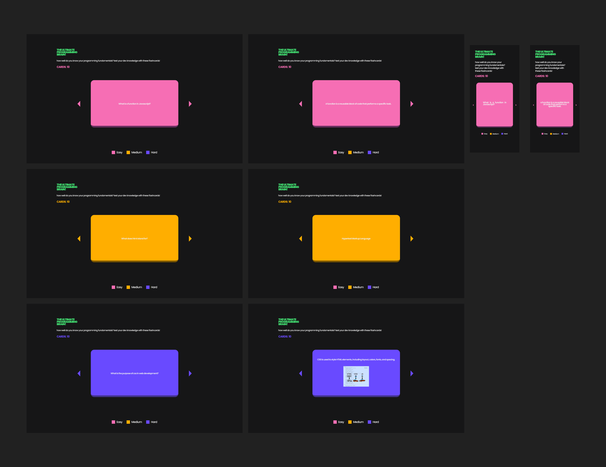

# Web Development Project 2 - *Flashcards*

Submitted by: **Justin Mora**

This is: **A responsive flashcard app built with React. Each flashcard contains a question and an answer, with difficulty levels visually distinguished by color. Now enhanced to support rich HTML content including images within answers, making it ideal for visual learners and technical subjects.**

Time spent: **13** hours spent in total

## Required Features

- [x] **The app displays the title of the card set, a short description, and the total number of cards**
  - [x] Title of card set is displayed 
  - [x] A short description of the card set is displayed 
  - [x] A list of card pairs is created
  - [x] The total number of cards in the set is displayed 
  - [x] Card set is represented as a list of card pairs (an array of dictionaries where each dictionary contains the question and answer is perfectly fine)
- [x] **A single card at a time is displayed**
  - [x] Only one half of the information pair is displayed at a time
- [x] **Clicking on the card flips the card over, showing the corresponding component of the information pair**
  - [x] Clicking on a card flips it over, showing the back with corresponding information 
  - [x] Clicking on a flipped card again flips it back, showing the front
- [ ] **Clicking on the next button displays a random new card**

### Part 2

The following **required** functionality is completed:

- [x] **The user can enter their guess into an input box *before* seeing the flipside of the card**
  - Application features a clearly labeled input box with a submit button where users can type in a guess
  - Clicking on the submit button with an **incorrect** answer shows visual feedback that it is wrong 
  -  Clicking on the submit button with a **correct** answer shows visual feedback that it is correct
- [x] **The user can navigate through an ordered list of cardss**
  - A forward/next button displayed on the card navigates to the next card in a set sequence when clicked
  - A previous/back button displayed on the card returns to the previous card in the set sequence when clicked
  - Both the next and back buttons should have some visual indication that the user is at the beginning or end of the list (for example, graying out and no longer being available to click), not allowing for wrap-around navigation

The following **optional** features are implemented:

- [x] Cards contain images in addition to or in place of text
  - [x] Some or all cards have images in place of or in addition to text
- [x] Cards have different visual styles such as color based on their category
  - Example categories you can use:
    - Difficulty: Easy/medium/hard
    - Subject: Biology/Chemistry/Physics/Earth science

The following **additional** features are implemented:

- [x] Smooth animations for flipping cards (3D transitions or effects)
  - [x] Dynamic color changes for card background and text based on difficulty or category

part 2
- [x] Added a dynamic card counter to clearly show the user's current position within the flashcard set.

## Video Walkthrough

Here's a walkthrough of implemented required features:

Here's a walkthrough of implemented required features of part 2:

GIF created with
[Kap](https://getkap.co/) for macOS

## Notes

Describe any challenges encountered while building the app.

- [ ] Displaying HTML in card answers
      It was tricky to show images inside answers because React escapes HTML by default.
- [ ] Making the layout fully responsive
      Getting the flashcards to scale well on smaller screens took some trial and error with clamp() and percentages.

Part 2
- [ ] Synchronizing input and feedback
      Managing the timing between submitting a guess and showing whether it was right or wrong 
- [ ] Handling answer comparison logic
      Making the app compare the user's guess to the correct answer
## License

    Copyright [2025] [Justin Mora]

    Licensed under the Apache License, Version 2.0 (the "License");
    you may not use this file except in compliance with the License.
    You may obtain a copy of the License at

        http://www.apache.org/licenses/LICENSE-2.0

    Unless required by applicable law or agreed to in writing, software
    distributed under the License is distributed on an "AS IS" BASIS,
    WITHOUT WARRANTIES OR CONDITIONS OF ANY KIND, either express or implied.
    See the License for the specific language governing permissions and
    limitations under the License.
